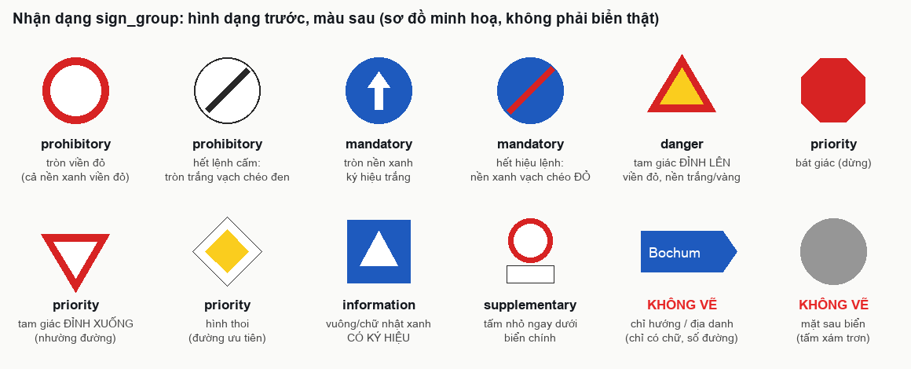
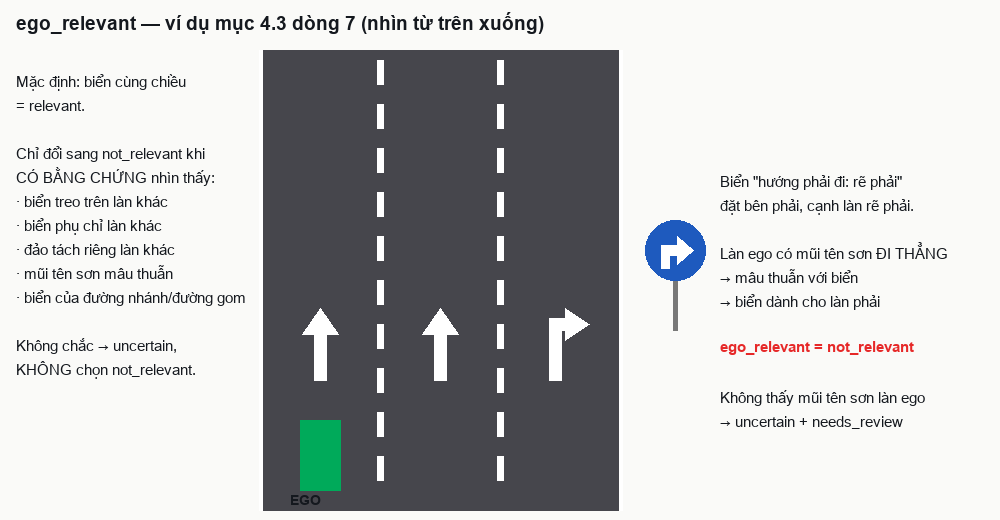
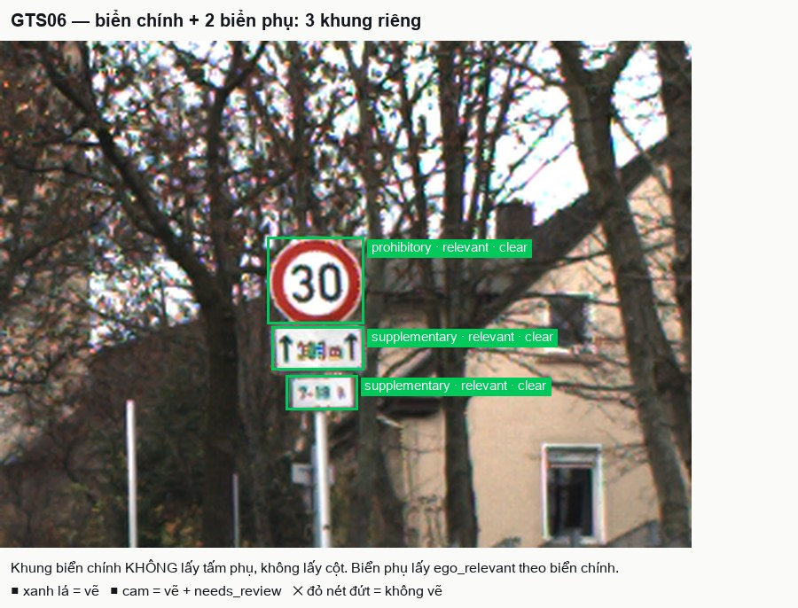
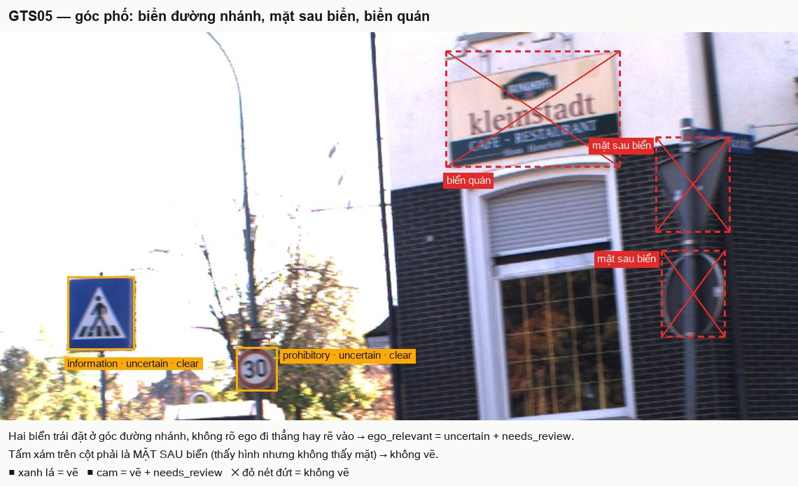
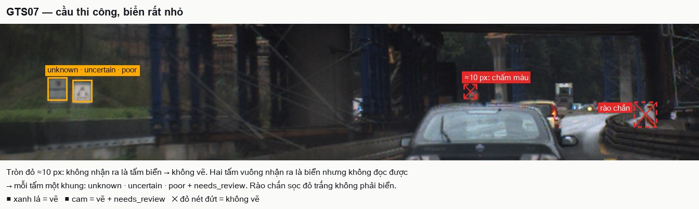
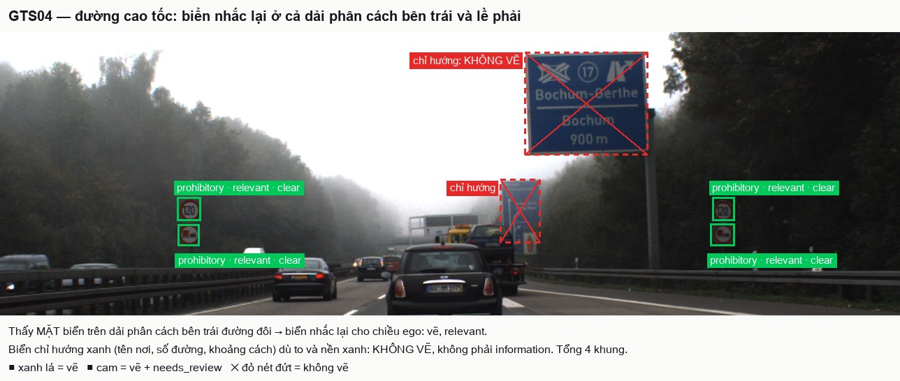

# Annotation guideline — Gắn nhãn biển báo giao thông theo nhóm chức năng

**Version:** v2

<!--
v0 = chưa có bản nháp. Đổi dòng Version ở trên thành v1 khi xong bản nháp đầu, v2 sau calibration, v3 sau blind
handoff; mỗi lần tăng version ghi một dòng vào 08_revision_log.md. `make freeze` đòi v2 trở lên.

File này là thứ nhóm peer nhận nguyên văn trong blind pack và là Guide dán vào CVAT. Peer KHÔNG nhận
edge_case_cards.md, gold_decisions.csv hay sample_pack.csv. Rule nào peer cần biết phải nằm ở đây.
No hidden rules: rule chỉ giải thích bằng miệng thì coi như không tồn tại.
Ví dụ trong guideline chỉ dùng ảnh split example hoặc calibration, không dùng ảnh blind.
-->

## 1. Objective + scope

**Mục đích:** tạo dữ liệu huấn luyện cho mô-đun nhận biết biển báo của xe tự lái / ADAS: mỗi biển có **một khung** và
**một nhóm chức năng** (`sign_group`). Nhóm cho biết biển tác động thế nào tới việc lái: cấm, bắt buộc, cảnh báo, quy
định quyền ưu tiên, thông tin, hay bổ sung ý nghĩa cho biển khác. Bài này **không** đọc nội dung cụ thể (ví dụ 30
hay 50 km/h). Mỗi biển có thêm hai thuộc tính: biển **có áp dụng cho làn xe mình đang chạy không**
(`ego_relevant`, mục 4.3) và **mức nhìn thấy** (`visibility`, mục 4.4).

Nhóm được định nghĩa theo **chức năng**, không theo chương của một quy chuẩn quốc gia, để cùng một guideline dùng được
cho ảnh Đức (dữ liệu lớp học, GTSDB) và ảnh Việt Nam (dự án thật, **QCVN 41:2024/BGTVT**, thay thế QCVN 41:2019). Bảng
ở mục 4 cho biết cách nhận dạng ở từng nước và mã biển VN tương ứng.

**Trong scope:** mọi **biển báo giao thông thật** (tấm biển cố định, biển tạm công trường, biển điện tử) mà **mặt biển
nhìn thấy được** từ camera, kể cả biển ở đường nhánh hay phía bên kia đường, miễn là thấy mặt biển.

**Ngoài scope (không vẽ):** xem danh sách đầy đủ ở mục 5.

## 2. Annotation unit

- Đơn vị là **ảnh tĩnh**. Không có track.
- **Một mặt biển = một khung.** Mặt biển là một hình biển hoàn chỉnh (một hình tròn, một tam giác, một bát giác, một
  hình thoi, một tấm chữ nhật).
- **Nhiều biển trên một cột:** mỗi mặt biển một khung, kể cả khi chúng sát nhau.
- **Biển phụ** (tấm nhỏ ngay dưới/trên biển chính) là **một khung riêng** với `sign_group = supplementary`. Không gộp
  vào khung biển chính.
- **Biển ghép** (một tấm nền vuông/chữ nhật có vẽ **nhiều hình biển đơn hoàn chỉnh**, mỗi hình có viền riêng, ví dụ
  "cấm ô tô + cấm xe máy + chữ giờ"): mỗi hình biển đơn là một khung, nhóm theo hình đó; toàn bộ vùng chữ/biểu tượng
  biển phụ trên tấm là **một** khung `supplementary`. Không vẽ khung cho tấm nền.
- **Biển chia ô theo làn** (một tấm chữ nhật có vạch chia cột theo từng làn, thường treo trên giá long môn / cột cần
  vươn, ví dụ tốc độ tối đa từng làn, hướng đi từng làn, làn dành cho loại xe): **một khung cho cả tấm**, nhóm theo
  ký hiệu bên trong (vòng tròn viền đỏ → `prohibitory`; mũi tên / ký hiệu xe trên nền xanh → `mandatory`).
- Hai biển giống hệt nhau ở hai bên đường là hai khung.

## 3. Geometry rule

- Dùng **Rectangle**, khung thẳng theo trục ảnh, **ôm sát mép ngoài mặt biển nhìn thấy** (kể cả viền).
- **Không lấy** cột, giá treo, khung sắt, bóng, tấm nền của bảng ghép.
- Biển tròn, tam giác, bát giác, thoi: khung là hình chữ nhật nhỏ nhất bao hết hình.
- Biển bị che hoặc bị cắt ở mép ảnh: khung ôm **phần nhìn thấy**, không suy đoán phần bị che.
- **Được zoom** trong CVAT để đặt mép khung cho chính xác.
- **Dung sai:** mỗi cạnh lệch không quá 3 px so với mép biển ở ảnh gốc; biển nhỏ (khung có cạnh ngắn dưới khoảng
  20 px) lệch không quá 2 px.

## 4. Taxonomy

Một label: `traffic_sign` (Rectangle). Phân loại nằm ở attribute. Bảng đầy đủ ở `03_ontology_and_cvat_setup.md`;
hai nơi phải khớp nhau.

| Attribute | Giá trị | Mặc định | Ghi chú |
|---|---|---|---|
| `sign_group` | `prohibitory` · `mandatory` · `danger` · `priority` · `information` · `supplementary` · `unknown` | `__undefined__` | Bắt buộc chọn; còn `__undefined__` trong export là chưa làm xong |
| `ego_relevant` | `relevant` · `not_relevant` · `uncertain` | `relevant` | Biển có áp dụng cho làn ego đang chạy không (mục 4.3) |
| `visibility` | `clear` · `partial` · `poor` | `clear` | Mức nhìn thấy mặt biển (mục 4.4) |
| `needs_review` | checkbox | tắt | Bật theo đúng các điều kiện ở mục 7 |

**Mặc định:** `ego_relevant` và `visibility` để sẵn giá trị gặp nhiều nhất (biển nhìn rõ, áp dụng cho ego) để giảm
thao tác. Hệ quả: **quên đổi thì biển bị ghi là rõ và liên quan**. Vì vậy với mỗi khung phải tự hỏi hai câu ở 4.3 và
4.4 trước khi sang khung khác. `sign_group` **không** có mặc định: nhóm sai là lỗi nặng nhất, nên người vẽ phải chủ
động chọn.

### 4.1 Nhóm và cách nhận dạng

QCVN 41:2024 (Điều 11) chia biển thành 5 nhóm: cấm (P, DP), hiệu lệnh (R, R.E), nguy hiểm và cảnh báo (W), chỉ dẫn
(I, IE), phụ và viết bằng chữ (S, S.G, S.H). Bài này giữ gần như nguyên 5 nhóm đó, chỉ tách thêm `priority`: các biển
quyết định ai đi trước tại nút giao nằm rải ở ba nhóm QCVN (R.122, W.208, I.401/I.402) và mỗi nước xếp một khác, nên
gom theo chức năng để không phụ thuộc quốc gia.

| `sign_group` | Chức năng | Nhận dạng ở Đức | Nhận dạng ở VN (QCVN 41:2024) |
|---|---|---|---|
| `prohibitory` | Cấm một hành vi, hoặc **hết** một lệnh cấm | Tròn viền đỏ nền trắng (tốc độ tối đa, cấm vượt, cấm xe…); tròn nền xanh viền đỏ (cấm dừng/đỗ); tròn đỏ gạch ngang trắng (cấm vào); tròn trắng có vạch chéo đen/xám (hết lệnh cấm) | Nhóm P, DP: tròn viền đỏ nền trắng; P.102 cấm đi ngược chiều (tròn đỏ gạch ngang trắng); P.130, P.131 cấm dừng/đỗ (nền xanh viền đỏ); P.132 nhường xe ngược chiều qua đường hẹp; DP.133–DP.135, DP.127 hết lệnh cấm (tròn trắng vạch chéo đen); P.127b/c tốc độ từng làn (tấm chữ nhật chia làn chứa vòng tròn viền đỏ) |
| `mandatory` | Bắt buộc làm theo, hoặc **hết** một hiệu lệnh | Tròn nền xanh, ký hiệu trắng (mũi tên, vòng xuyến, đường dành cho…); tròn xanh có vạch chéo đỏ (hết hiệu lệnh); tấm vàng tên thị trấn (bắt đầu khu dân cư) và tấm đó có vạch chéo đỏ (hết khu dân cư) | Nhóm R: tròn nền xanh ký hiệu trắng (R.301–R.310); chữ nhật xanh R.403/R.404 (đường dành cho…), R.411 (hướng đi từng làn), R.412 (làn dành cho loại xe), R.415, R.420/R.421 (bắt đầu/hết khu đông dân cư), R.E (khu vực); vạch chéo đỏ đè lên hình trắng = hết hiệu lệnh (Điều 33.1) |
| `danger` | Cảnh báo nguy hiểm phía trước | Tam giác **đỉnh hướng lên**, viền đỏ, **nền trắng** | Nhóm W: tam giác **đỉnh hướng lên**, viền đỏ, **nền vàng** (trừ W.208, xem `priority`); W.224 người đi bộ cắt ngang; W.227 công trường |
| `priority` | Quy định quyền đi trước tại nút giao | Dừng (bát giác đỏ STOP); nhường đường (tam giác **đỉnh hướng xuống**); đường ưu tiên / hết đường ưu tiên (hình thoi vàng viền trắng) | R.122 "Dừng lại" (bát giác đỏ); W.208 "Giao nhau với đường ưu tiên" (tam giác **đỉnh hướng xuống**); I.401 / I.402 bắt đầu / hết đường ưu tiên (hình thoi) |
| `information` | Thông tin **làm thay đổi cách lái** | Vuông/chữ nhật xanh có **ký hiệu**: người đi bộ sang đường, đường một chiều, đường cụt, nơi đỗ xe, được ưu tiên qua đường hẹp, bắt đầu/hết cao tốc | Nhóm I, IE có ký hiệu: I.423 vị trí người đi bộ sang ngang, I.407 đường một chiều, I.405 đường cụt, I.408 nơi đỗ xe, I.406 được ưu tiên qua đường hẹp, I.409/I.410 chỗ quay xe, biển bắt đầu/hết cao tốc |
| `supplementary` | Bổ sung ý nghĩa cho biển chính | Tấm chữ nhật trắng nhỏ dưới biển chính: khoảng cách, giờ, loại xe, mũi tên phạm vi | Nhóm S (Điều 41): S.501 phạm vi, S.502 khoảng cách, S.503 hướng tác dụng, S.504 làn đường, S.505 loại xe, S.508 thời gian, S.509 thuyết minh (kể cả tấm "TẠM THỜI"); **S.507 "Hướng rẽ"** (tấm mũi tên đặt độc lập ở đường cong) cũng là `supplementary` |
| `unknown` | Chắc chắn là biển nhưng không đủ bằng chứng để chọn nhóm | — | — |

### 4.2 Thứ tự quyết định nhóm (áp dụng từ trên xuống, dừng ở dòng đầu tiên khớp)

1. Tấm **gắn ngay dưới/trên** một biển chính, chỉ có chữ/số/mũi tên phạm vi/hình xe, **hoặc** tấm mũi tên hướng rẽ
   đặt độc lập ở đường cong → `supplementary`.
2. Hình **bát giác**, tam giác **đỉnh hướng xuống**, hoặc **hình thoi** → `priority`.
3. Có **viền đỏ tròn**, hoặc là **tròn trắng có vạch chéo đen/xám** → `prohibitory` (viền đỏ thắng nền xanh). Tấm chia
   làn chứa vòng tròn viền đỏ cũng vào đây.
4. **Nền xanh** (tròn, hoặc chữ nhật trong danh sách `mandatory` ở 4.1), kể cả khi có **vạch chéo đỏ** (hết hiệu lệnh)
   → `mandatory`. Biển bắt đầu/hết khu dân cư cũng vào đây dù có chữ tên nơi.
5. Tam giác **đỉnh hướng lên**, viền đỏ (nền trắng hoặc vàng) → `danger`.
6. Vuông/chữ nhật có **ký hiệu** trong danh sách `information` ở 4.1 → `information`.
7. Vuông/chữ nhật chỉ có **tên địa danh, số đường, khoảng cách tới nơi, mũi tên chỉ hướng đi tới nơi** (VN: I.414,
   I.415, I.419, biển chỉ hướng IE trên cao tốc) → **không vẽ** (mục 5).
8. **Biển viết bằng chữ** đứng riêng (Điều 42.2): nền đỏ chữ trắng bắt đầu bằng "Cấm" → `prohibitory`; nền đỏ chữ
   trắng khác → `mandatory`; nền vàng chữ đen → `danger`; nền xanh chữ trắng → `information` nếu không phải chỉ hướng.
9. Không khớp dòng nào ở trên, hoặc nhìn không rõ hình/màu → `unknown` và bật `needs_review`.

Dùng **hình dạng trước, màu sau**. Màu dễ sai khi lóa, tối, phai; hình dạng ổn định hơn. Hai tấm chữ nhật xanh khó
phân biệt `mandatory` với `information` (ví dụ R.411 hướng đi từng làn và I.407 đường một chiều): phân vân thì chọn
nhóm nghiêng tới nhất và bật `needs_review`.

### 4.3 `ego_relevant` — biển có áp dụng cho làn ego không

**Ego** là xe gắn camera. **Làn ego** là làn nằm dưới giữa mép dưới ảnh (camera đặt giữa xe), xác định bằng vạch kẻ
đường hai bên điểm đó. **Đường đi của ego** là làn ego đi thẳng tới trước; bài này không biết ego sẽ rẽ hay không.

Nguyên tắc gốc (QCVN 41:2024 Điều 15): biển nguy hiểm và biển chỉ dẫn có hiệu lực trên **mọi làn của chiều xe chạy**;
biển cấm và biển hiệu lệnh áp dụng cho mọi làn **hoặc chỉ một số làn** nếu biển cho biết như vậy. Do đó: biển thuộc
chiều đi của ego mặc định là `relevant`, trừ khi có **bằng chứng nhìn thấy** rằng biển chỉ dành cho làn khác hoặc
đường khác.

Xét lần lượt, dừng ở dòng đầu tiên khớp:

| # | Tình huống | `ego_relevant` |
|---|---|---|
| 1 | Biển của **đường khác**: đặt ở góc đường nhánh / đường cắt ngang và quay mặt vào đường đó; đặt bên kia dải phân cách cứng cho **đường gom, đường song song, nhánh ra cao tốc** mà ego không ở trên đó | `not_relevant` |
| 2 | Biển **dành cho người đi bộ, xe đạp, xe thô sơ** trên vỉa hè / làn riêng tách khỏi phần đường ego (ví dụ đường dành cho người đi bộ, làn xe đạp) | `not_relevant` |
| 3 | Biển **treo phía trên một làn cụ thể** (giá long môn, cột cần vươn, mỗi biển nằm đúng trên một làn): nằm trên làn ego → `relevant`; nằm trên làn khác → `not_relevant` | theo vị trí |
| 4 | **Biển chia ô theo làn** (một khung cả tấm, mục 2): có một ô dành cho làn ego | `relevant` |
| 5 | Biển có **biển phụ chỉ làn** (VN: S.504 "Làn đường", mũi tên chỉ làn) không gồm làn ego | `not_relevant` |
| 6 | Biển đặt trên **đảo / dải phân cách tách riêng một làn** (làn rẽ phải có đảo, làn rẽ trái tách riêng) mà ego không ở làn đó | `not_relevant` |
| 7 | **Biển hướng đi bắt buộc đặt bên đường** (mũi tên rẽ, mũi tên đi thẳng) nhưng **mũi tên sơn trên làn ego mâu thuẫn** với biển. Ví dụ ego ở làn trái có mũi tên sơn đi thẳng, biển "hướng phải đi: rẽ phải" đặt bên phải cạnh làn rẽ phải: biển dành cho làn rẽ phải | `not_relevant` |
| 8 | Biển thuộc chiều đi của ego, đặt bên phải, bên trái hoặc phía trên phần đường, **không có bằng chứng 1–7**. Gồm cả: **biển nhắc lại trên dải phân cách giữa / lề trái của đường đôi** (thấy được mặt biển thì biển quay về chiều ego, vì biển của chiều ngược lại chỉ thấy mặt sau); **biển trên đảo giao thông / đầu dải phân cách ngay phía trước ego** chỉ hướng đi vòng (tròn xanh mũi tên chéo) | `relevant` |
| 9 | Không đủ bằng chứng để chọn (không thấy vạch làn, không rõ biển quay về đường nào, biển xa ở ngã tư chưa biết thuộc nhánh nào, biển bên trái có thể của chiều ngược lại) | `uncertain` + `needs_review` |

Quy tắc bổ sung:

- **Không suy luận theo loại xe.** Biển cấm xe tải vẫn `relevant` nếu nằm trên đường đi của ego; hệ thống phía sau tự
  so với loại xe.
- **Biển phụ** lấy cùng giá trị `ego_relevant` với biển chính mà nó gắn vào.
- **Hai biển giống nhau hai bên đường** (lặp lại cho cùng chiều) đều `relevant` và **đều phải vẽ** (GTS04).
- **Bỏ trống không phải là cách escalate.** Không biết chọn gì thì chọn `uncertain` và bật `needs_review`; khung còn
  giá trị rỗng / `__undefined__` là khung chưa làm xong.
- **Không chắc giữa `relevant` và `not_relevant` thì chọn `uncertain`**, không chọn `not_relevant`. Ghi nhầm một biển
  dừng/nhường/cấm đang áp dụng cho ego thành `not_relevant` là lỗi nghiêm trọng nhất của thuộc tính này.

### 4.4 `visibility` — mức nhìn thấy mặt biển

| Giá trị | Khi nào |
|---|---|
| `clear` | Thấy **toàn bộ** mặt biển (bị che hoặc cắt dưới khoảng 1/4), hình và màu rõ, không lóa/mờ đáng kể |
| `partial` | Bị che hoặc cắt ở mép ảnh **từ khoảng 1/4 trở lên**, nhưng phần thấy vẫn rõ nét |
| `poor` | **Nhỏ, xa, mờ, nhoè, lóa, ngược sáng, tối, phai màu, nhìn chéo nhiều**: hình hoặc màu không rõ, dù có thể không bị che |

- Biển vừa bị che vừa mờ: chọn `poor`.
- `sign_group = unknown` thì `visibility` **không được** là `clear` (đã rõ thì phải chọn được nhóm).
- `visibility` mô tả ảnh, không mô tả độ chắc của người vẽ. Không chắc nhóm thì dùng `needs_review`, không hạ
  `visibility`.

## 5. Inclusion / exclusion

**Bắt buộc vẽ:** mọi mặt biển thuộc scope nhận ra được là biển (mục 6), kể cả biển nhỏ ở xa, ở mép ảnh, ở đường
nhánh, ở phía bên kia đường, biển tạm công trường (trên giá chân, trên rào chắn, trên xe công trình), biển điện tử.

**Không vẽ (IGNORE):**

- **Biển chỉ hướng / địa danh:** tấm chỉ có tên nơi, số đường, khoảng cách tới nơi, mũi tên chỉ đường đi tới nơi
  (thường xanh, vàng hoặc trắng, nhiều tấm xếp chồng ở ngã tư). Đây là dữ liệu cho bài toán dẫn đường, không thuộc
  bài này.
- **Mặt sau** của biển (tấm xám/kim loại trơn) và biển quay cạnh không thấy mặt.
- **Hình ảnh của biển** không có hiệu lực giao thông: biển in trên quảng cáo, trên thân xe buýt/xe tải, phản chiếu
  trong kính, gương, vũng nước.
- Vật giống biển nhưng không phải biển báo giao thông: đèn giao thông, biển hiệu cửa hàng, biển quảng cáo, biển tên
  phố, số nhà, biển thông báo tư nhân trên hàng rào, cọc tiêu, cọc sọc chỉ hướng, rào chắn sọc đỏ trắng, chữ/mũi tên
  sơn trên mặt đường.
- Ảnh **không có biển** nào đủ điều kiện: để trống. Đây là đáp án đúng, nhưng chỉ kết luận sau khi đã quét hết ảnh ở
  cỡ gốc (mục 10.1).

## 6. Visibility / occlusion

| Tình huống | Cách làm |
|---|---|
| Chỉ là một **chấm màu**, không nhận ra được là tấm biển (thường cạnh dưới khoảng 12 px) | **Không vẽ** |
| Nhận ra là **tấm biển**, thấy rõ hình và màu | Vẽ khung, chọn nhóm theo 4.2, `visibility = clear` |
| Nhận ra là tấm biển nhưng **không rõ hình hoặc màu** (nhỏ, xa, mờ) | Vẽ khung, `unknown`, `visibility = poor`, bật `needs_review` |
| **Bị che dưới khoảng 1/4** | Vẽ khung phần thấy, chọn nhóm, `visibility = clear` |
| **Bị che từ khoảng 1/4 tới dưới một nửa**, còn đủ hình và màu | Vẽ khung phần thấy, chọn nhóm, `visibility = partial` |
| Bị che **từ khoảng một nửa trở lên** nhưng vẫn đoán được nhóm | Vẽ khung phần thấy, chọn nhóm, `visibility = partial`, bật `needs_review` |
| Bị che mất **hình đặc trưng** (không biết tròn hay tam giác) | Vẽ khung phần thấy, `unknown`, `visibility = partial`, bật `needs_review` |
| **Bị cắt ở mép ảnh** | Như các dòng bị che ở trên, tuỳ phần còn thấy |
| **Lóa, ngược sáng, ban đêm, mưa, phai màu** | `visibility = poor`. Chọn nhóm nếu **hình dạng** còn rõ; chỉ còn màu mà không rõ hình → `unknown` + `needs_review` |
| **Nhìn chéo, biển nghiêng, biển bị gãy/đổ** | Vẫn là biển; chọn nhóm theo hình nhìn thấy, `visibility = poor`, bật `needs_review` |
| **Biển điện tử (VMS)** đang hiển thị | Hiện hình biển → nhóm theo hình đó. Chỉ hiện chữ → nhóm theo **màu chữ** (QCVN 41:2024 Điều 14.2.5): đỏ `prohibitory`, trắng hoặc da cam `mandatory`, vàng `danger`, xanh lam `information`. Không đọc được → `unknown` + `needs_review` |
| Biển điện tử **tắt hoặc trống** | **Không vẽ** (không truyền thông tin nào) |
| **Biển bị bọc, bị gạch chéo tạm** (ngừng hiệu lực) | Vẽ khung, `unknown`, bật `needs_review` |

**Không suy đoán:** được zoom để nhìn, nhưng nhóm chỉ chọn theo cái nhìn thấy trong ảnh. Không dùng ngữ cảnh (ví dụ
"sắp tới ngã tư nên chắc là biển nhường đường") để đoán nhóm của biển không nhìn rõ.

## 7. Ambiguity / escalation

| Quyết định | Khi nào | Thể hiện trong CVAT |
|---|---|---|
| **LABEL** | Biển thuộc scope, chọn được nhóm và `ego_relevant` chắc chắn | Có khung, `sign_group` là một trong sáu nhóm, `ego_relevant` là `relevant` hoặc `not_relevant`, `needs_review` tắt |
| **IGNORE** | Thuộc danh sách "không vẽ" ở mục 5, hoặc chỉ là chấm màu | **Không có khung** |
| **UNKNOWN** | Chắc chắn là biển, không đủ bằng chứng chọn nhóm | Có khung, `sign_group = unknown`, `needs_review` bật |
| **ESCALATE** | Có nghi ngờ cần người thứ hai xem | Có khung, `needs_review` bật, `sign_group` là nhóm bạn nghiêng tới nhất hoặc `unknown`; không rõ biển có áp dụng cho ego không thì `ego_relevant = uncertain` |

**`needs_review` bật khi và chỉ khi** có ít nhất một điều kiện sau:

1. `sign_group = unknown`.
2. Biển bị che hoặc cắt từ khoảng một nửa trở lên.
3. Phân vân giữa hai nhóm (chọn nhóm nghiêng tới nhất).
4. Không chắc vật đó là biển báo giao thông hay không (vẫn vẽ).
5. Biển nghiêng, gãy, đổ, bị bọc, hoặc biển điện tử.
6. `ego_relevant = uncertain`.

Quy tắc khi phân vân:

- **Không chắc có nên vẽ hay không → vẽ và bật `needs_review`.** Bỏ sót một biển cấm/ưu tiên nghiêm trọng hơn vẽ thừa.
  Ngoại lệ: biển chỉ hướng/địa danh luôn không vẽ.
- **`unknown` không bị tính là sai** khi ảnh thật sự không đủ bằng chứng. Đoán sai nhóm thì bị tính sai.
- Trong lúc vẽ không có ai để hỏi. Tình huống guideline chưa nói tới: dùng thứ tự 4.2; không khớp thì `unknown` +
  `needs_review`.

## 8. Temporal rule

**Không áp dụng — task ảnh tĩnh.** Mỗi ảnh vẽ độc lập.

## 9. Examples

Ví dụ dùng ảnh split `example` và `calibration` (không dùng ảnh blind). Ảnh minh hoạ nằm ở `guideline_assets/` cạnh file này: **xanh lá** = vẽ,
**cam** = vẽ và bật `needs_review`, **✕ đỏ nét đứt** = không vẽ. Nhãn trên khung ghi theo thứ tự
`sign_group · ego_relevant · visibility`.

| sample_id | Thấy gì | Expected output | Rule áp dụng |
|---|---|---|---|
| GTS06 | Biển tròn viền đỏ "30" bên phải đường ego, **hai tấm phụ** bên dưới (mũi tên phạm vi + khoảng cách; giờ áp dụng); đèn giao thông bị cắt ở mép trên phải | 3 khung riêng: `prohibitory`, `supplementary`, `supplementary`; cả ba `relevant`, `clear`. Khung biển chính không lấy tấm phụ và cột. Đèn: không vẽ | 2, 3, 4.2 (dòng 1, 3), 4.3 (biển phụ theo biển chính), 5 |
| GTS05 | Góc phố: biển vuông xanh người đi bộ và biển tròn "30" ở góc đường nhánh bên trái; hai tấm xám trên cột bên phải là **mặt sau** biển; biển quán cà phê, biển tên phố | 2 khung: `information` và `prohibitory`, cả hai `uncertain` (không rõ ego đi thẳng hay rẽ vào đường nhánh), `clear`, bật `needs_review`. Mặt sau biển, biển quán, biển tên phố: không vẽ | 4.2 (dòng 3, 6), 4.3 (dòng 9), 5 |
| GTS04 | Cao tốc có sương mù; cặp biển "120" + cấm xe tải vượt ở **cả** dải phân cách bên trái và lề phải; biển chỉ hướng xanh phía trên | 4 khung `prohibitory`, tất cả `relevant`, `clear`. Biển chỉ hướng: không vẽ | 2, 4.2 (dòng 3, 7), 4.3 (dòng 8) |
| GTS03 | Ngã tư phố: hình thoi vàng; tam giác người đi bộ; biển tròn "20" kèm tấm mũi tên rẽ bên dưới; biển tròn xanh mũi tên phía trái | `priority` (hình thoi), `danger` (tam giác), `prohibitory` ("20"), `supplementary` (tấm mũi tên, khung riêng), `mandatory` (tròn xanh). Không dồn biển lạ vào một nhóm chung | 2, 4.2 (dòng 1–5) |
| GTS07 | Cầu đang thi công, đường ướt; một chấm tròn đỏ khoảng 10 px ở giữa ảnh; hai tấm vuông nhỏ bên trái, nhận ra là tấm biển nhưng không đọc được; rào chắn sọc đỏ trắng bên phải | Chấm đỏ: không vẽ. Hai tấm vuông: mỗi tấm một khung `unknown`, `uncertain`, `poor`, bật `needs_review`. Rào chắn: không vẽ | 5, 6, 4.4 |

Các tình huống chưa có ảnh ví dụ (nhường đường, biển dừng, biển chỉ hướng xếp chồng, biển bị che) dùng bảng 4.1,
thứ tự 4.2 và hai sơ đồ ở mục 4.

## 10. Common mistakes

1. **Kết luận "ảnh không có biển" khi chưa quét cỡ gốc.** Zoom và quét cả hai bên đường, phía trên, phía xa (GTS07).
2. **Lấy cột, tấm nền, biển phụ vào khung biển chính.**
3. **Gộp nhiều biển trên một cột vào một khung.** Mỗi mặt biển một khung.
4. **Nhầm hai loại biển người đi bộ:** tam giác đỉnh lên là `danger` (cảnh báo); vuông xanh là `information`.
5. **Nhầm tam giác:** đỉnh hướng lên là `danger`; đỉnh hướng xuống là `priority`.
6. **Nhầm biển nền xanh viền đỏ (cấm dừng/đỗ) là `mandatory`.** Viền đỏ thì là `prohibitory`.
7. **Nhầm hai loại biển "hết":** tròn trắng vạch chéo đen/xám (hết lệnh cấm) là `prohibitory`; nền xanh có vạch chéo
   đỏ (hết hiệu lệnh, hết khu dân cư) là `mandatory`. Không chọn `unknown` hay `information` cho các biển này.
8. **Vẽ biển chỉ hướng/địa danh.** Chỉ vẽ tấm vuông/chữ nhật có ký hiệu trong danh sách `information` / `mandatory`.
   Ngoại lệ dễ quên: biển bắt đầu/hết khu dân cư có tên nơi nhưng là `mandatory`.
9. **Đoán nhóm cho biển không rõ** thay vì `unknown` + `needs_review`.
10. **Quên bật `needs_review`** ở các điều kiện của mục 7, hoặc bật tuỳ tiện ở biển rõ ràng.
11. **Vẽ mặt sau biển, đèn giao thông, biển quảng cáo** vì trông giống biển.
12. **Để nguyên mặc định `relevant` / `clear`** cho biển đường nhánh, biển bị che, biển mờ. Mặc định chỉ đúng cho biển
    rõ nằm trên đường đi của ego; mọi khung khác phải đổi.
13. **Chọn `not_relevant` khi chỉ nghi ngờ.** Không có bằng chứng ở 4.3 dòng 1–7 thì là `relevant`; không chắc thì
    `uncertain`.
14. **Đánh `not_relevant` cho biển bên trái đường.** Biển có thể đặt bổ sung bên trái hoặc trên cao cho cùng chiều
    (QCVN 41:2024 Điều 16.2); vị trí trái/phải một mình không đủ để kết luận.
15. **Bỏ sót biển nhắc lại bên trái** trên đường đôi / cao tốc (GTS04): quét cả dải phân cách giữa, không chỉ lề phải.

## Self-QC trước khi export

Kiểm từng ảnh trước khi export; còn sai một dòng thì sửa rồi mới export.

- [ ] Không còn khung nào có `sign_group = __undefined__` (dùng bộ lọc / danh sách object của CVAT).
- [ ] Khung `sign_group = unknown` thì `visibility` là `partial` hoặc `poor`, và `needs_review` bật.
- [ ] Khung `ego_relevant = uncertain` thì `needs_review` bật.
- [ ] Biển đường nhánh, biển bị che, biển mờ đã đổi khỏi mặc định `relevant` / `clear` nếu cần (4.3, 4.4).
- [ ] Đã quét cả lề phải, dải phân cách / lề trái, phía trên đường và phía xa ở cỡ gốc.
- [ ] Biển phụ là khung riêng; khung biển chính không lấy cột hay tấm phụ.
